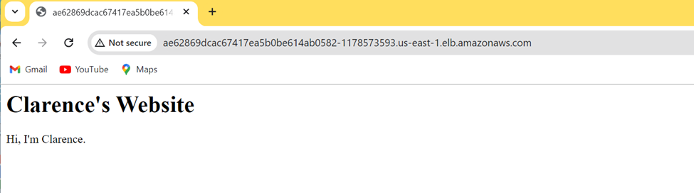

# terraform-eks
A sample repository to create EKS on AWS using Terraform.

### Install AWS CLI 
As the first step, you need to install AWS CLI as we will use the AWS CLI (`aws configure`) command to connect Terraform with AWS in the next steps.
Follow the below link to Install AWS CLI.
```
https://docs.aws.amazon.com/cli/latest/userguide/getting-started-install.html
```
### Install Terraform
Next, Install Terraform using the below link.
```
https://developer.hashicorp.com/terraform/tutorials/aws-get-started/install-cli
```
### Connect Terraform with AWS
Its very easy to connect Terraform with AWS. Run `aws configure` command and provide the AWS Security credentials as shown in the video.

### Initialize Terraform
Clone the repository and Run `terraform init`. This will intialize the terraform environment for you and download the modules, providers and other configuration required.

### Optionally review the terraform configuration
Run `terraform plan` to see the configuration it creates when executed.

### Finally, Apply terraform configuation to create EKS cluster with VPC 
`terraform apply`

### Output from terraform apply
Outputs:

cluster_endpoint = "https://9DFE2240E9F2EF80951822A065A69BF5.gr7.us-east-1.eks.amazonaws.com"
cluster_name = "clkg-eks-tceoRkdT"
cluster_security_group_id = "sg-00d57d9d04ef7330f"
oidc_provider_arn = "arn:aws:iam::211125333559:oidc-provider/oidc.eks.us-east-1.amazonaws.com/id/9DFE2240E9F2EF80951822A065A69BF5"    
region = "us-east-1"

### Use kubectl to manage your cluster and deploy Kubernetes configurations to it.
`aws eks --region us-east-1 update-kubeconfig --name clkg-eks-tceoRkdT`

Added new context arn:aws:eks:us-east-1:211125333559:cluster/clkg-eks-tceoRkdT to C:\Users\Administrator\.kube\config

### Verify your cluster
`kubectl cluster-info`
```sh
Kubernetes control plane is running at https://9DFE2240E9F2EF80951822A065A69BF5.gr7.us-east-1.eks.amazonaws.com
CoreDNS is running at https://9DFE2240E9F2EF80951822A065A69BF5.gr7.us-east-1.eks.amazonaws.com/api/v1/namespaces/kube-system/services/kube-dns:dns/proxy
```
### Verify all worker nodes are part of the cluster
`kubectl get nodes`
NAME                         STATUS   ROLES    AGE     VERSION
ip-10-0-1-126.ec2.internal   Ready    <none>   7m25s   v1.29.8-eks-a737599
ip-10-0-2-123.ec2.internal   Ready    <none>   7m26s   v1.29.8-eks-a737599

### To deploy a sample application, create a namespace
`kubectl create namespace eks-sample-app`
namespace/eks-sample-app created

### Verify namespace is created
`kubectl get ns`
NAME              STATUS   AGE
default           Active   13m
eks-sample-app    Active   10s
kube-node-lease   Active   13m
kube-public       Active   13m
kube-system       Active   13m

### Create a Kubernetes and services deployment
`eks-nginx-deployment.yaml` 
`services.yaml`

### Apply the deployment manifest to your cluster
`kubectl apply -f eks-nginx-deployment.yaml services.yaml`

### View all resources that exist in the eks-sample-app namespace
`kubectl get all -n eks-sample-app`
NAME                                        READY   STATUS    RESTARTS   AGE
pod/eks-nginx-deployment-684bdcbff7-5q4vx   1/1     Running   0          15s
pod/eks-nginx-deployment-684bdcbff7-gpxg6   1/1     Running   0          15s
pod/eks-nginx-deployment-684bdcbff7-zhvdd   1/1     Running   0          15s

NAME                               TYPE           CLUSTER-IP       EXTERNAL-IP                                                               PORT(S)        AGE
service/eks-sample-linux-service   LoadBalancer   172.20.206.219   ae62869dcac67417ea5b0be614ab0582-1178573593.us-east-1.elb.amazonaws.com   80:30630/TCP   8s

NAME                                   READY   UP-TO-DATE   AVAILABLE   AGE
deployment.apps/eks-nginx-deployment   3/3     3            3           16s

NAME                                              DESIRED   CURRENT   READY   AGE
replicaset.apps/eks-nginx-deployment-684bdcbff7   3         3         3       17s

### View the details of the deployed service
`kubectl -n eks-sample-app describe service eks-sample-linux-service`
Name:                     eks-sample-linux-service
Namespace:                eks-sample-app
Labels:                   app=eks-sample-linux-app
Annotations:              <none>
Selector:                 app=eks-sample-linux-app
Type:                     LoadBalancer
IP Family Policy:         SingleStack
IP Families:              IPv4
IP:                       172.20.206.219
IPs:                      172.20.206.219
LoadBalancer Ingress:     ae62869dcac67417ea5b0be614ab0582-1178573593.us-east-1.elb.amazonaws.com
Port:                     <unset>  80/TCP
TargetPort:               80/TCP
NodePort:                 <unset>  30630/TCP
Endpoints:                10.0.1.107:80,10.0.1.14:80,10.0.2.93:80
Session Affinity:         None
External Traffic Policy:  Cluster
Events:
  Type    Reason                Age   From                Message
  ----    ------                ----  ----                -------
  Normal  EnsuringLoadBalancer  99s   service-controller  Ensuring load balancer
  Normal  EnsuredLoadBalancer   96s   service-controller  Ensured load balancer

### View the details of one of the Pods listed in the output
`kubectl -n eks-sample-app describe pod eks-nginx-deployment-684bdcbff7-5q4vx`    
Name:             eks-nginx-deployment-684bdcbff7-5q4vx
Namespace:        eks-sample-app
Priority:         0
Service Account:  default
Node:             ip-10-0-1-126.ec2.internal/10.0.1.126
Start Time:       Thu, 26 Sep 2024 20:53:08 +0800
Labels:           app=eks-sample-linux-app
                  pod-template-hash=684bdcbff7
Annotations:      <none>
Status:           Running
IP:               10.0.1.14
IPs:
  IP:           10.0.1.14
Controlled By:  ReplicaSet/eks-nginx-deployment-684bdcbff7
Containers:
  nginx:
    Container ID:   containerd://9f119078288e31b3d1351d83a932a4ad5896937b4a828e168546597de765f2fa
    Image:          211125333559.dkr.ecr.us-east-1.amazonaws.com/clowkg:latest
    Image ID:       211125333559.dkr.ecr.us-east-1.amazonaws.com/clowkg@sha256:dfad7987b39b1b2e1300b6dcb3b7b33df5c43d6132845db4cf76c3cadf7dd6f4
    Port:           80/TCP
    Host Port:      0/TCP
    State:          Running
      Started:      Thu, 26 Sep 2024 20:53:14 +0800
    Ready:          True
    Restart Count:  0
    Environment:    <none>
    Mounts:
      /var/run/secrets/kubernetes.io/serviceaccount from kube-api-access-2kjq9 (ro)
Conditions:
  Type                        Status
  PodReadyToStartContainers   True
  Initialized                 True
  Ready                       True
  ContainersReady             True
  PodScheduled                True
Volumes:
  kube-api-access-2kjq9:
    Type:                    Projected (a volume that contains injected data from multiple sources)
    TokenExpirationSeconds:  3607
    ConfigMapName:           kube-root-ca.crt
    ConfigMapOptional:       <nil>
    DownwardAPI:             true
QoS Class:                   BestEffort
Node-Selectors:              kubernetes.io/os=linux
Tolerations:                 node.kubernetes.io/not-ready:NoExecute op=Exists for 300s
                             node.kubernetes.io/unreachable:NoExecute op=Exists for 300s
Events:
  Type    Reason     Age    From               Message
  ----    ------     ----   ----               -------
  Normal  Scheduled  3m55s  default-scheduler  Successfully assigned eks-sample-app/eks-nginx-deployment-684bdcbff7-5q4vx to ip-10-0-1-126.ec2.internal
  Normal  Pulling    3m54s  kubelet            Pulling image "211125333559.dkr.ecr.us-east-1.amazonaws.com/clowkg:latest"
  Normal  Pulled     3m49s  kubelet            Successfully pulled image "211125333559.dkr.ecr.us-east-1.amazonaws.com/clowkg:latest" in 4.955s (4.955s including waiting)
  Normal  Created    3m49s  kubelet            Created container nginx
  Normal  Started    3m49s  kubelet            Started container nginx

### Run a shell on the Pod that you described in the previous step
`kubectl exec -it eks-nginx-deployment-684bdcbff7-5q4vx -n eks-sample-app -- /bin/bash`

### From the Pod shell, view the output from the web server that was installed with your deployment in a previous step
`curl eks-sample-linux-service`
<html>
    <body>
        <h1>Clarence's Website</h1>
        <p>Hi, I'm Clarence.</p>
    </body>
 </html>

### From the Pod shell, view the DNS server for the Pod
`cat /etc/resolv.conf`
search eks-sample-app.svc.cluster.local svc.cluster.local cluster.local ec2.internal
nameserver 172.20.0.10
options ndots:5

### Accessing your nginx app open your browser with that EXTERNAL-IP you can see something like this in your browser



### Once you are done destroy the resources you created in this tutorial to avoid incurring extra charges
`terraform destroy`


